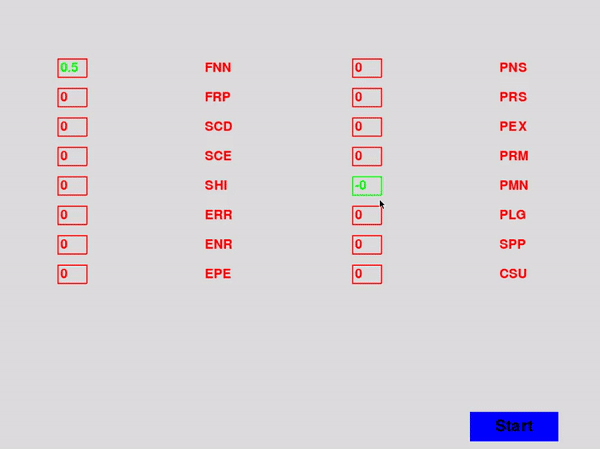

# Circular business models simulation

  

> Circular business models could minimise material input into and leakage out of the economic system and play an essential role in utilising the resources and apabilities of the private sector for the transition to more sustainable economic development.

This project aims to create a dynamic simulation of the models mentioned in the article below. Using the ifferent types of interactions it is possible to have a better graphic visualization.
## Requeriments

- [Anaconda Distribution (Python 3.x Version)](https://www.anaconda.com/distribution/)
- [Installing PyGame](https://stackoverflow.com/a/53472187)
### Optional (IDE)
- [Visual Studio Code](https://code.visualstudio.com/)
## Extra content

- [Towards a value stream perspective of circular business models](https://www.sciencedirect.com/science/article/abs/pii/S0921344920303773)

## Authors
| [ @aluizgc](https://github.com/aluizgc) | [ @Pfalcao97](https://github.com/Pfalcao97) |
| :---: | :---: |

